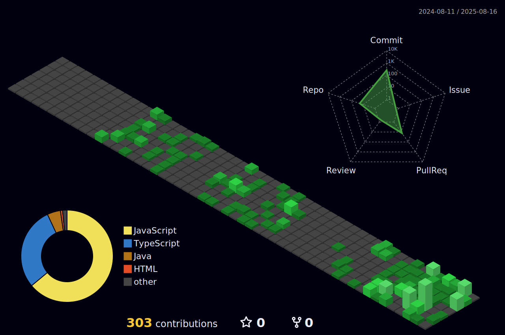

### Hi there! 

I’m [**Shashi Ranjan Singh**](https://www.miraya.tech), a fullstack engineer based in India.
  

  

- 🔭 I’m currently working on **Ecommerce Project**

- 🌱 I’m currently learning **DSA**

- 💬 Ask me about **JavaScript, React, Next.Js**

- 📫 reach me @  **prathamjii36@gmail.com**

- 👯 I’m looking to collaborate on **on open-source projects related to Web Development**

- 👀 I’m interested in **Frontend Development, Backend Development**
  
- ⚡ Fun fact **I go to sleep when you wake up.**

#### Connect With Me:

  

#### Languages Tools and Technologies:

                 

  

#### Github Analytics:
 

<markdown-accessiblity-table data-catalyst="">
  <table style="width: 100%; background-color: #1e1e1e; color: white; table-layout: fixed;">
    <thead>
	    <tr>
		  <th colspan="2" align="center">
			   
		  </th>
		</tr>
      <tr>
        <th style="padding: 20px; text-align: center;">
          
        </th>
        <th style="padding: 20px; text-align: center;">
          
        </th>
      </tr>
    </thead>
	   <tr>
        <td  colspan="2" align="center"> 
		 
	
		
<!-- <picture>
  		<source media="(prefers-color-scheme: dark)" srcset="https://raw.githubusercontent.com/PrathamSingh1/PrathamSingh1/output/github-contribution-grid-snake-dark.svg" />
  <source media="(prefers-color-scheme: light)" srcset="https://raw.githubusercontent.com/PrathamSingh1/PrathamSingh1/output/github-contribution-grid-snake.svg" />
  
</picture> -->
	</td>
	</tr>
  </table>
  
</markdown-accessiblity-table>

